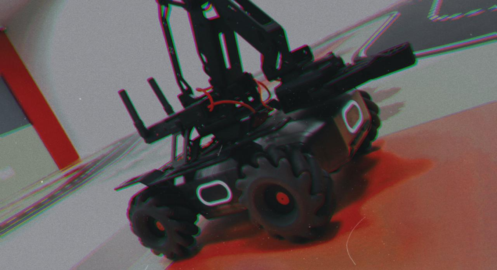
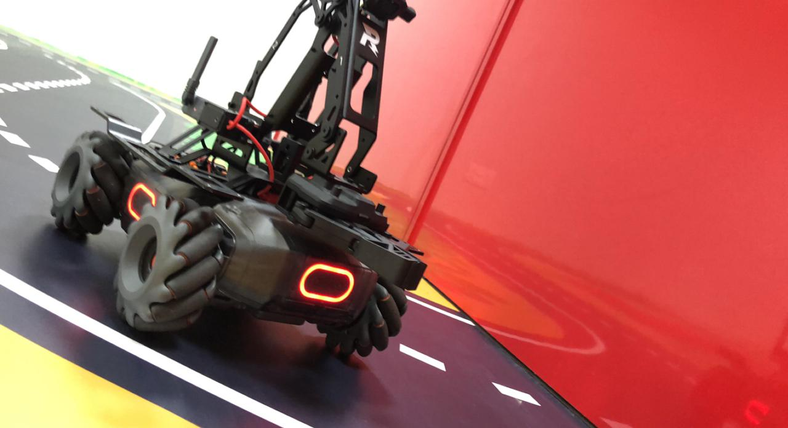

# MobileRobot-Openloopcontrol
## Aim:

To develop a python control code to move the mobilerobot along the predefined path.

## Equipments Required:
1. RoboMaster EP core
2. Python 3.7

## Procedure

### Step1:
Initiate the MobileRobot.

### Step2:
Connect your PC with the MobileRobot.

### Step3:
Open Python program.

### Step4:
Program the movements of the robot using python code.

### Step5:
Execute the python program.

## Program
```python
from robomaster import robot
import time

if _name_ == '_main_':
    ep_robot = robot.Robot()
    ep_robot.initialize(conn_type="ap")

    ep_led = ep_robot.led
    ep_led.set_led(comp="all",r=255,g=0,b=0,effect="on")

if _name_ == '_main_':
    ep_robot = robot.Robot()
    ep_robot.initialize(conn_type="ap")

    ep_chassis = ep_robot.chassis

    ep_chassis.move(x=3.8, y=0, z=0, xy_speed=0.87).wait_for_completed()

    ep_chassis.move(x=0, y=0, z=-40, xy_speed=0.75).wait_for_completed()

    ep_chassis.drive_speed(x=0.2,y=0,z=12)
    time.sleep(9)

    ep_chassis.move(x=2.4, y=0, z=0, xy_speed=0.80).wait_for_completed()

    ep_chassis.drive_speed(x=0.2,y=0,z=11)
    time.sleep(25)

    ep_chassis.move(x=2.7, y=0, z=0, xy_speed=0.75).wait_for_completed()

    ep_chassis.move(x=0, y=0, z=-47, xy_speed=0.75).wait_for_completed()

    ep_chassis.move(x=1.7, y=0, z=0, xy_speed=0.75).wait_for_completed()

    ep_chassis.move(x=0, y=0, z=-40, xy_speed=0.75).wait_for_completed()

    ep_chassis.move(x=1, y=0, z=0, xy_speed=0.75).wait_for_completed()

    ep_chassis.move(x=0, y=0, z=-51, xy_speed=0.75).wait_for_completed()

    ep_chassis.move(x=1.5, y=0, z=0, xy_speed=0.75).wait_for_completed()

    ep_chassis.drive_speed(x=0.2,y=0,z=-13)
    time.sleep(5)
    
    ep_robot.close()
```

## MobileRobot Movement Image:





## MobileRobot Movement Video:

(https://youtu.be/xnsYKiCjVrI)

## Result:
Thus the python program code is developed to move the mobilerobot in the predefined path.


```
Mobile Robotics Laboratory
Department of Artificial Intelligence and Data Science/ Machine Learning
Saveetha Engineering College
```
